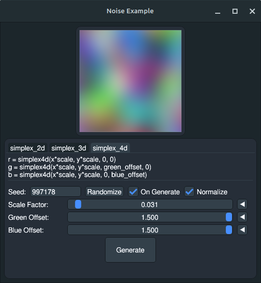
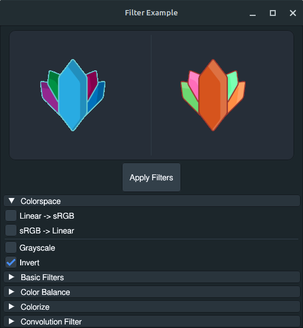

#  ImgScal

A tool for automating image processing. Allows for creating of custom workflows
writing in lua.

* Run image processing tasks written using lua.
* CLI interface with portable exe.

## Run

```sh
make start
# or
make dev
```

* `make dev` runs `make install-examples` then `make start`.
* Use `make start` for a first time launch, as `make install-examples` requires a valid config.

## Examples

> Examples can be installed by running `make install-examples`.
> This requires ImgScal to have been run at least **once**,
> as the config file and workflow directory must exist.

### GUI/Noise - [Source](/examples/example_noise.lua)

Demo workflow that creates an interface with controls to generate noise maps.



### GUI/Filter - [Source](/examples/example_filter.lua)

Demo workflow that creates an interface to apply filters to an image.



## Known Issues

* There is an upstream issue related to `mainthread` when running on Windows.
  * Sometimes causes the application to crash within the first frame of the master window.
  * Sometimes prevents `gui.update()` from updating the UI when called from a scheduled function.
  * Recommended to run through WSL when using the gui library on Windows.
* Some parts of the `gui` library may not work properly.
  * `gui.css_parse()` is added but the underlying `g.ParseCSSStyleSheet()` is currently broken.
  * `gui.wg_css_tag()` can still be used, but will not have any affect until the upstream issue is fixed.
* When a lua panic occurs outside of the `gui.window_run()` loop, it may cause the window to not close until the process is closed.
  * Looking for a solution as calling `.Close()` on an already closed window causes GLFW to break until the process is restarted, and there is no publically exported field to check if a window is active.
* It is currently possible to deadlock in certain circumstances.
  * Passing the same collection item twice into a function that schedules on it. e.g. `image.draw()`
  * Calling a function that schedules on a collection item within a function already running for that
    collection item. e.g. Calling `image.size()` within the callback of `image.map()` for the same images.

## Build

* Requires
  * Go
  * Makefile
  * A C compiler (mingw, TDM-GCC or g++)

* Windows

```sh
make build-windows
```

* Linux

```sh
make build-linux
```

## Documentation

Run `make doc` to generate the lua api documentation to `./docs/`.

## Logs

There is an entrypoint at `./cmd/log` that can be called to print the log file `@latest.txt` if it exists. `make log` is a shortcut for calling this.

> This can also be used to pipe the output.

```sh
make log | grep '! ERROR'
make log | kate -i
make log > latest.txt
```

### Log Prefixes

* `# SYSTEM`
* `# INFO`
* `? WARN`
* `! ERROR`
* `!! IMPORTANT` - Reserved for debug logs during development.

## Config

The default config file:

> Located at `%CONFIG%/imgscal/config.json`

```json
{
    "config_version": "0.1.0",
    "workflow_directory": "%HOME%/imgscal/workflow",
    "output_directory": "%HOME%/imgscal/output",
    "log_directory": "%HOME%/imgscal/log",
    "disable_logs": false,
    "always_confirm": false
}
```

> `%CONFIG%` is retrieved from [`os.UserConfigDir()`](https://pkg.go.dev/os#UserConfigDir) and `%HOME%` from [`os.UserHomeDir()`](https://pkg.go.dev/os#UserHomeDir).

### Config Fields

* `config_version` is set based on a constant when created,
currently unused but should not be changed.
Will be used for compatibility if ever needed.
* `workflow_directory` is the directory the program uses for finding and running workflows.
* `output_directory` is a directory that can be used by workflows for outputting files.
  * Workflows can get this directory with `io.default_output()`, though user provided paths and
relative paths should take precedent when outputting.
* `log_directory` is the directory used to save log files from both the config and run states for workflows.
  * The most recently generated log also gets saved as `@latest.txt`.
* `disable_logs` when set to true turns off all log output to files.
* `always_confirm` when set to true skips the confirmation screen before running a workflow.
