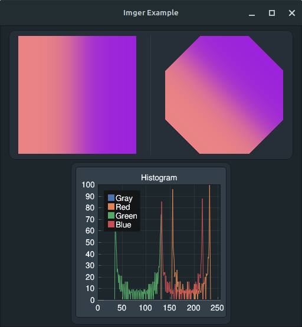

#  ImgScal

Automate image processing programmatically.

* Built around concurrency.
* Workflows writteng in lua.
* Builtin handling for image encodings and color models.
* Included ImGui wrapper for building custom GUI tools.
* Spritesheet support.
* Command-line support, e.g. `imgscal resize ./image.png 100 100`.

## Documentation - [Live](https://artificiallegacy.github.io/imgscal/)

Run `make doc` to generate the lua api documentation to `./docs/`.

## Run

```sh
make start
# or
make dev
```

* `make dev` runs `make install-examples` then `make start`.
* Use `make start` for a first time launch, as `make install-examples` requires a valid config.

## Examples

> Examples can be installed by running `make install-examples`.
> This requires ImgScal to have been run at least **once**,
> as the config file and workflow directory must exist.

### GUI/Imger - [Source](/examples/gui/imger.lua)

Demo worflow that creates an interface with controls to apply filters from the Imger library onto images.



### GUI/Noise - [Source](/examples/gui/noise.lua)

Demo workflow that creates an interface with controls to generate noise maps.


### GUI/Filter - [Source](/examples/gui/filter.lua)

Demo workflow that creates an interface to apply filters to an image.


## Build

* Requires
  * Go >= 1.22.6
  * Makefile
  * A C compiler (mingw, TDM-GCC or g++)

```sh
make build-windows
# or
make build-linux
```

## Logs

There is an entry point at `./cmd/log` that can be called to print the log file `@latest.txt` if it exists. `make log` is a shortcut for calling this.

> This can also be used to pipe the output.

```sh
make log | grep '! ERROR'
make log | kate -i
make log > latest.txt
```

## Known Issues

* There is an upstream issue related to `mainthread` when running on Windows.
  * Sometimes causes the application to crash within the first frame of the master window.
  * Sometimes prevents `gui.update()` from updating the UI when called from a scheduled function.
  * Recommended to run through WSL when using the gui library on Windows.
* Some parts of the `gui` library may not work properly.
  * `gui.css_parse()` is added but the underlying `g.ParseCSSStyleSheet()` is currently broken.
  * `gui.wg_css_tag()` can still be used, but will not have any affect until the upstream issue is fixed.
* When a lua panic occurs outside of the `gui.window_run()` loop, it may cause the window to not close until the process is closed.
  * Looking for a solution as calling `.Close()` on an already closed window causes GLFW to break until the process is restarted, and there is no publically exported field to check if a window is active.
* It is currently possible to deadlock in certain circumstances.
  * Calling a function that schedules on a collection item within a function already running for that
    collection item. e.g. Calling `image.size()` within the callback of `image.map()` for the same images.
